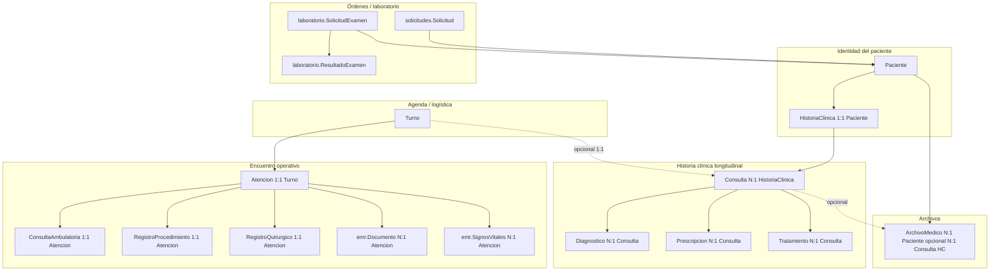

# Auditoría del dominio clínico (estado actual del código)

Este documento describe **cómo está modelado y expuesto el dominio clínico en el repositorio actual**, derivado exclusivamente del análisis de modelos, metadatos, ViewSets declarados en `api/urls.py` y vistas enlazadas. **No incluye propuestas de solución.**

---

## 1. Alcance y método

- **Incluye:** apps `historias_clinicas`, `turnos`, `solicitudes`, `laboratorio`, `archivos_medicos`, `emr` (modelos `Documento`, `SignosVitales`), `internacion` (infraestructura y segundo modelo de internación), catálogos solo como referencia de vínculos (CIE-10, medicamentos, etc.).
- **Excluye:** detalle de permisos finos en frontend, reglas de negocio no reflejadas en Python, datos de producción.

---

## 2. Mapa de entidades clínicas (alto nivel)

---

## 3. App `historias_clinicas`

### 3.1 Modelos y relaciones

| Modelo | Rol | Relaciones clave |
|--------|-----|-------------------|
| **HistoriaClinica** | Contenedor longitudinal **1:1** con `Paciente` (PK = paciente). | `paciente` |
| **Consulta** | Visita clínica en el tiempo; pertenece a una HC. | `FK` → `HistoriaClinica`; `OneToOne` opcional → `Turno`; `FK` → `Medico` |
| **Diagnostico** | Diagnóstico estructurado + texto. | `FK` → `Consulta`; `FK` opcional → `catalogos.DiagnosticoCIE10`; M2M → `Sintoma` |
| **Sintoma** | Catálogo de síntomas. | — |
| **Tratamiento** | Tratamiento asociado a una consulta HC. | `FK` → `Consulta` |
| **Prescripcion** | Prescripción con medicamento de catálogo. | `FK` → `Consulta`; `FK` → `catalogos.Medicamento` |
| **Internacion** (en esta app) | Internación con cama de catálogo (`catalogos.CamaInternacion`), motivo, plan, número de internación, `FK` opcional a `Turno` origen. | `FK` → `Paciente`, `Medico`, `CamaInternacion`, `Turno` |

**Modelo `Evolucion`:** **no existe** en el código comprobado (búsqueda global sin resultados). La “evolución” como entidad separada **no está modelada**.

### 3.2 Datos clínicos que almacena (Consulta)

Definidos en `historias_clinicas.models.Consulta`, entre otros:

- `motivo_consulta_detalle`, **`anamnesis`**, `examen_fisico`, **`diagnostico_presuntivo`** (texto libre), `plan_manejo`, `notas_medicas`
- Metadatos: `fecha_hora_consulta`, `fecha_registro`, `ultima_actualizacion`

### 3.3 Uso actual (API)

- **`GET/.../historias-clinicas/`** — `HistoriaClinicaViewSet` (**solo lectura**). Filtro `paciente`. Acción `resumen`: últimas consultas + diagnósticos recientes.
- **`/consultas/`** — `ConsultaViewSet` (`historias_clinicas.views`): CRUD; `create` usa `ConsultaCreateSerializer`; creación asegura `HistoriaClinica` con `get_or_create` sobre el paciente.
- **`/diagnosticos/`**, **`/prescripciones/`**, **`/internaciones/`** — ViewSets en `api.views` operan sobre modelos importados de `historias_clinicas.models` (p. ej. `Internacion` rico con `medico_responsable`, `estado`, `cama__area__centro_fisico` en filtros).

### 3.4 Responsabilidades reales

- **Historia clínica longitudinal** por paciente (contenedor).
- **Consulta** como **encuentro documentado en el eje HC** (no obligatoriamente el mismo flujo que `Atencion`).
- **Diagnostico** “oficial” en sentido de **modelo relacional + CIE-10** está **anclado a `Consulta` (HC)**, no a `ConsultaAmbulatoria`.
- **Internación “compleja”** (estados `ACTIVA`, `ALTA_*`, etc.) vive en **`historias_clinicas.Internacion`** y se expone en **`/api/internaciones/`**.

---

## 4. App `turnos`

### 4.1 Modelos centrales

| Modelo | Representación |
|--------|----------------|
| **Turno** | Reserva logística: paciente, médico, recurso, ventana temporal, estado (`RESERVADO`…`REALIZADO`), `motivo_reserva` corto. |
| **Atencion** | **“Contenedor principal para un encuentro clínico”** (docstring del modelo). `OneToOne` con `Turno`; `FK` `paciente`, `medico_principal`; `tipo_atencion` alineado con tipo de `Recurso`; `tipo_intervencion` (CONSULTA / ESTUDIO / PROCEDIMIENTO / CIRUGÍA); `estado_clinico`; `observaciones_generales`; fechas admisión/cierre. |
| **ConsultaAmbulatoria** | Registro **1:1** con `Atencion` (PK = atención). Campos: `anamnesis`, `examen_fisico`, `diagnostico_presuntivo`, `plan_manejo`, `antecedentes_relevantes`, `alergias`, `medicacion_actual`, **`diagnostico_definitivo`**, `observaciones_medicas`. |
| **RegistroProcedimiento** | 1:1 `Atencion`: descripción, informe, hallazgos, catálogos de estudio/procedimiento, `adjunto_resultado` (FileField). |
| **RegistroQuirurgico** | 1:1 `Atencion`: anestesista, diagnósticos pre/post operatorio, protocolo, complicaciones, equipo (JSON), archivos, M2M a `emr.Documento`. |

### 4.2 Flujo clínico modelado (código)

1. **Turno** confirma/recurso → creación de **Atencion** (p. ej. `AtencionViewSet.create` en `turnos/views.py` o flujos alternos en `api/views` / `AtencionService`).
2. **`AtencionService.iniciar_atencion_desde_turno`** (cuando se usa): pone turno en `REALIZADO`, crea `Atencion`, y **materializa un registro hijo** según recurso: `ConsultaAmbulatoria` (consultorio), `RegistroProcedimiento` (sala procedimiento), `RegistroQuirurgico` (quirófano/hemodinamia) con **placeholders** en quirúrgico (`diagnostico_preoperatorio` / `protocolo_quirurgico` “Pendiente de completar”).
3. **Consulta ambulatoria** en producción frecuente vía **`POST .../atenciones/{id}/registrar-consulta/`** (y acciones compatibles): valida tipo `CONSULTA`, persiste/actualiza `ConsultaAmbulatoria`, puede marcar **turno `REALIZADO`** si hay contenido clínico.

### 4.3 Endpoints / serializers principales

- **`/api/turnos/`** — `TurnoViewSet` (`turnos.views`).
- **`/api/atenciones/`** — `AtencionViewSet` (`turnos.views`): create por `turno`, `cerrar`, `registrar-consulta`, `crear_registro_ambulatorio`.
- **`/api/consultas-ambulatorias/`** — `ConsultaAmbulatoriaViewSet` (`api.views`).
- **`/api/registros-procedimientos/`**, **`/api/registros-quirurgicos/`** — ViewSets en `api.views`.

---

## 5. App `solicitudes` y laboratorio

### 5.1 `solicitudes.Solicitud`

- **Órdenes genéricas** por paciente: tipo (`EXAMEN_LABORATORIO`, `ESTUDIO_IMAGEN`, etc.), descripción, observaciones, estado, prioridad.
- **Integración LIMS de capa aplicación:** `lims_id`, `lims_paneles`, `lims_tipos_examen`, flags de sincronización; `save()` puede invocar `integracion_lims.lims_service` según env.
- **No hay** en el modelo campos `ForeignKey` a `Atencion`, `Consulta` (HC) ni `SolicitudExamen` (laboratorio).

**Uso:** `SolicitudViewSet` en `solicitudes/views.py`, registro bajo **`/api/solicitudes/`**.

### 5.2 `laboratorio.SolicitudExamen` y `ResultadoExamen`

- **Orden de laboratorio** propia del módulo LIMS: paciente, médico interno o nombre externo, origen (`EMR`, papel, etc.), M2M a `TipoExamen` / `PanelExamen`, estado de workflow lab, `numero` tipo protocolo `LAB-YYYY-…`.
- **Resultados** en `ResultadoExamen` por tipo de examen.
- **No hay** en el modelo referencia a `Atencion` ni a `solicitudes.Solicitud` (sin FK cruzada en los archivos revisados).

**Uso:** `SolicitudExamenViewSet` en `laboratorio/views.py` — rutas **`/api/lab/solicitudes/`** y **`/api/laboratorio/solicitudes/`** (alias).

### 5.3 Relación con “encounters”

- **`Solicitud` (app solicitudes):** acoplada al **paciente** y médicos; **no** al encuentro EMR (`Atencion`).
- **`SolicitudExamen` (laboratorio):** acoplada al **paciente** (y médico/display); **no** al encuentro EMR en modelo.

Interpretación factual: las **órdenes y resultados de laboratorio** en este diseño son **principalmente paralelas al flujo Turno→Atencion**, salvo vínculos narrativos o externos no modelados aquí.

---

## 6. Archivos y documentos

### 6.1 `archivos_medicos.ArchivoMedico`

- **Titularidad de la evidencia:** `FK` obligatoria a **`Paciente`**; **`FK` opcional a `historias_clinicas.Consulta`** (no a `Atencion`).
- Metadatos: tipo, archivo, fechas, `subido_por` (usuario).

**API:** **`/api/archivos-medicos/`** (`archivos_medicos.urls` incluido en `api/urls`). Permisos de listado para médicos usan **`Consulta`** de HC para inferir pacientes atendidos (no `Atencion`).

### 6.2 `emr.Documento`

- **`FK` obligatoria a `Atencion`**. Tipos (`INFORME`, `ESTUDIO`, `DIAGNOSTICO`, `CONSENTIMIENTO`, etc.), `FileField`, usuario cargador.
- **Propiedad narrativa:** documento formal **del encuentro EMR**.

**API:** **`/api/documentos/`** — `DocumentoViewSet` (`api.views`).

### 6.3 Relación con `Atencion`

- **Directa:** `emr.Documento`, `RegistroQuirurgico.documentos_adjuntos` (M2M), `RegistroProcedimiento.adjunto_resultado` (archivo en el propio modelo).
- **Indirecta / paralela:** `ArchivoMedico` se ancla a **HC `Consulta`** si se informa; no al modelo `Atencion`.

### 6.4 `emr.SignosVitales`

- Modelo con **`FK` a `Atencion`**, medidas antropométricas y vitales, `registrado_por`.
- Existe **`SignosVitalesViewSet`** en `api.views`, pero **no está registrado** en `api/urls.py` en el estado auditado (ViewSet huérfano de ruta API principal).

---

## 7. Duplicaciones detectadas (solo hechos)

1. **Dos modelos de “consulta” con campos homónimos:** `historias_clinicas.Consulta` y `turnos.ConsultaAmbulatoria` almacenan **anamnesis, examen físico, diagnóstico presuntivo, plan** en paralelo; además `ConsultaAmbulatoria` añade **diagnóstico definitivo** y antecedentes/alergias/medicación.
2. **Dos modelos llamados `Internacion`:** `historias_clinicas.Internacion` (catálogo `CamaInternacion`, estados ricos, API `/api/internaciones/`) e `internacion.Internacion` (cama `internacion.Cama`, API bajo **`/api/internacion/`**). Misma palabra de dominio, **implementaciones distintas**.
3. **Dos sistemas de “solicitud” de laboratorio/integración:** `solicitudes.Solicitud` (LIMS genérico + JSON) y `laboratorio.SolicitudExamen` (workflow + resultados). Sin FK entre ellos en modelos.
4. **Posible duplicación de ViewSets legacy:** `api/views.py` contiene implementaciones extensas de `AtencionViewSet` y otros; el **router principal** en `api/urls.py` registra **`AtencionViewSet` desde `turnos.views`**, no desde `api.views`. Riesgo de **doble fuente de lógica** si se confunden importaciones.
5. **`models.py` en la raíz del repo y `emr/models.py`:** ambos definen clases con `Meta.app_label = 'emr'` para `SignosVitales` y `Documento`. **`emr/models.py`** declara más valores en `Documento.TipoDocumento` (**`ESTUDIO`, `ANALISIS`, `DIAGNOSTICO`**) que el **`models.py` raíz**; coexisten en el árbol fuente (riesgo de divergencia si no se trata como copia obsoleta).

---

## 8. Inconsistencias detectadas (solo hechos)

1. **Un mismo `Turno` puede referenciar** vía `OneToOne` una **`historias_clinicas.Consulta`** **y** una **`Atencion`** (cada una con su `OneToOne` al turno). No hay restricción en modelo que fusione ambos flujos.
2. **Diagnóstico CIE estructurado** está en **`Diagnostico` → `Consulta` (HC)**; **`ConsultaAmbulatoria`** solo tiene textos `diagnostico_presuntivo` / `diagnostico_definitivo` **sin** relación al modelo `Diagnostico` ni CIE-10 en el esquema auditado.
3. **Prescripciones y tratamientos** del modelo relacional están **ligados a `Consulta` (HC)**, no a `ConsultaAmbulatoria` / `Atencion`.
4. **Evidencia de imagen/archivo** puede vivir en **`ArchivoMedico` (paciente + Consulta HC)** o en **`Documento` (Atencion)** o **adjuntos de procedimiento/quirórgico** — **tres vías** con semánticas distintas.
5. **Permisos de acceso a archivos médicos** para médicos se basan en **`Consulta` de HC**, no en participación en `Atencion` — posible desalineación con el eje encuentro-turno.

---

## 9. Riesgos arquitectónicos (observación, sin remedio propuesto)

- **Múltiples fuentes de verdad** para el mismo concepto narrativo (anamnesis, diagnóstico en texto) entre HC y flujo de atención.
- **Internación doble** incrementa riesgo de datos en el “lugar equivocado” según qué API use el cliente.
- **Órdenes de laboratorio** desacopladas del encuentro dificultan reconstruir **qué visita** originó un examen **solo desde el modelo**.
- **Código legacy** duplicado (`api/views` vs `turnos/views`) aumenta el riesgo de correcciones aplicadas en un solo sitio.
- **Signos vitales** modelados pero **sin ruta API** en el router principal reduce trazabilidad operativa frente a otros datos de `Atencion`.

---

## 10. Timeline clínico REAL (según modelos)

Orden **típico** admitido por el diseño (no todo es obligatorio en cada paciente):

1. **Paciente** + (opcional) **`HistoriaClinica`** creada o implicitamente referida.
2. **`Turno`** programado / confirmado.
3. **`Atencion`** creada para el turno (encuentro operativo).
4. Según recurso: **`ConsultaAmbulatoria`** / **`RegistroProcedimiento`** / **`RegistroQuirurgico`** (a veces creado vacío o con placeholders por servicio).
5. Registro de notas y cierre: **`registrar-consulta`**, **`cerrar`**, actualización de turno a **`REALIZADO`** en flujos que lo disparan.
6. **En paralelo o independiente:** **`historias_clinicas.Consulta`** con **`Diagnostico`**, **`Prescripcion`**, **`Tratamiento`** — flujo **longitudinal** vía API `/consultas/`.
7. **Órdenes:** `solicitudes.Solicitud` y/o `laboratorio.SolicitudExamen` por **paciente**, sin FK de encuentro.
8. **Archivos:** `ArchivoMedico` (paciente ± HC `Consulta`) y/o `Documento` / adjuntos ligados a **Atencion**.

No existe entidad única “timeline” agregada; la reconstrucción es **por joins y convención de uso**.

---

## 11. “Encounter” clínico REAL (definición material en código)

El modelo que el propio código describe como contenedor del encuentro es **`turnos.Atencion`** (docstring: *“Contenedor principal para un encuentro clínico”*), con **1:1** opcional con **`Turno`**.

La **`historias_clinicas.Consulta`** es un **encuentro documentado en la historia longitudinal** (`HistoriaClinica`), con **opción** de amarre al mismo `Turno`, pero **no** es el mismo registro que `ConsultaAmbulatoria`.

Por tanto, en este repositorio conviven **al menos dos nociones de “encuentro”**: **operativa (`Atencion`)** y **longitudinal (`Consulta` en HC)**.

---

## 12. Fuentes de verdad detectadas (resumen)

| Concepto | Dónde aparece en modelo (no exclusivo) |
|----------|----------------------------------------|
| Identidad / demographics | `Paciente` |
| HC agregada por paciente | `HistoriaClinica` |
| Encuentro logístico + clínico operativo | `Turno` + `Atencion` + registro hijo (`ConsultaAmbulatoria` / procedimiento / quirúrgico) |
| Encuentro en HC + diagnósticos CIE y prescripciones modelo | `Consulta` + `Diagnostico` + `Prescripcion` + `Tratamiento` |
| Diagnóstico en texto en flujo atención | `ConsultaAmbulatoria.diagnostico_*` |
| Diagnóstico en texto en HC | `Consulta.diagnostico_presuntivo` + `Diagnostico` |
| Orden genérica LIMS-friendly | `solicitudes.Solicitud` |
| Orden + resultados lab nativos | `SolicitudExamen` + `ResultadoExamen` |
| Documento del encuentro EMR | `emr.Documento` |
| Archivo clínico por paciente (y opcionalmente consulta HC) | `ArchivoMedico` |
| Internación “gestión avanzada” | `historias_clinicas.Internacion` + `/api/internaciones/` |
| Internación “cama simple” | `internacion.Internacion` + `/api/internacion/...` |

---

## 13. Validaciones obligatorias (respuestas explícitas)

### 1. ¿Dónde vive oficialmente la anamnesis?

- **Campo explícito `anamnesis` en dos sitios:** `historias_clinicas.Consulta.anamnesis` **y** `turnos.ConsultaAmbulatoria.anamnesis`.  
- No existe un modelo “Anamnesis” único; **no hay un único lugar oficial en base de datos** más allá de estas dos tablas paralelas.

### 2. ¿Dónde vive oficialmente el diagnóstico?

- **Diagnóstico codificado (CIE-10 vía catálogo) y nombre/detalles:** modelo **`historias_clinicas.Diagnostico`** ligado a **`Consulta` (HC)**.  
- **Diagnóstico en texto en el flujo atención/ambulatorio:** campos **`diagnostico_presuntivo`** y **`diagnostico_definitivo`** en **`ConsultaAmbulatoria`** (sin FK a `Diagnostico`).  
- **Diagnóstico texto en HC:** **`Consulta.diagnostico_presuntivo`**.  
- Otros textos (`RegistroQuirurgico.diagnostico_pre/postoperatorio`, `Internacion.diagnostico_ingreso`, etc.) añaden **más superficies** para el mismo concepto léxico.

### 3. ¿Dónde vive oficialmente la evolución clínica?

- **No hay entidad `Evolucion`** en el código auditado.  
- La narrativa tipo evolución aparece dispersa en **`notas_medicas`/`observaciones_*`/`informe_medico`/`hallazgos`** según contexto (**`Consulta`**, **`ConsultaAmbulatoria`**, procedimientos, internación, etc.), sin modelo dedicado.

### 4. ¿Cuál es el timeline clínico REAL del sistema?

- Ver **sección 10**. Es una **cadena composable** (Paciente → Turno → Atencion → registro hijo; paralelamente HC/Consulta/diagnósticos; órdenes y lab por paciente; archivos en varias tablas). **No hay un único objeto “timeline”.**

### 5. ¿Cuál es el encounter clínico REAL?

- El encounter **operativo** modelado como tal es **`Atencion`** (más su registro 1:1 según tipo).  
- Existe además **`historias_clinicas.Consulta`** como **encuentro en el eje de historia clínica longitudinal**, posiblemente ligado al mismo turno pero **registro distinto**.

### 6. ¿Existen múltiples fuentes de verdad clínicas?

- **Sí.** Evidencia en el código: duplicación de consulta (HC vs ambulatoria), duplicación de internación, duplicación de solicitudes lab (app `solicitudes` vs `laboratorio`), y múltiples depósitos de texto diagnóstico y archivos adjuntos **sin unión referencial única** entre todos los ejes.

---

*Fin del documento de auditoría (solo descripción del estado actual).*
